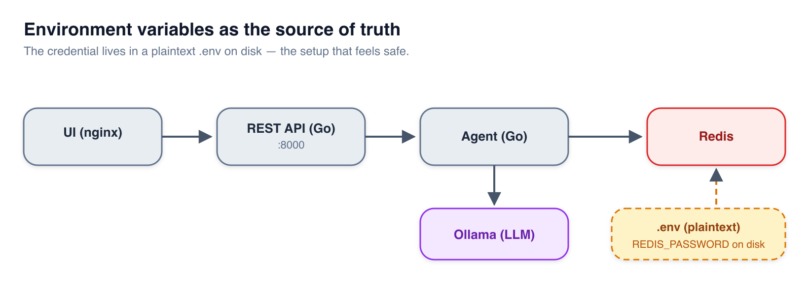

# Environment variables as the source of truth

> The credential in a `.env` file: the setup that *feels* safe, and why it isn't.

Part of **[What Your Agent Doesn't Know Can't Hurt You][series]**, a hands-on
series on keeping secrets out of an AI agent's reach.

---

A small AI assistant for a customer-support team: ask it about a customer in
natural language (tier, balance, account status, region) and it looks them up in
Redis and answers. The secret it depends on is the Redis connection credential,
and here that credential lives in a `.env` file.

This isn't a strawman. It's the setup most teams actually ship: the value is in
an environment variable, `.env` is git-ignored, and everything works. It feels
safe. The point of this branch is to sit with *why it isn't*. Everything after it
is about fixing it.

## How it works



The model only interprets intent and picks a customer id; the Go code owns the
actual Redis call. **The model never generates Redis commands**, a safety property
worth keeping as the app hardens.

## Prerequisites

- **Docker.** That's it. Ollama and the model run as containers, so nothing else
  needs to be installed.

## Run it

The `.env` is committed here on purpose (see [Why this isn't safe](#why-this-isnt-safe)),
so there's nothing to configure:

```bash
docker compose up --build -d
```

The first run pulls the model into a volume (a few minutes, cached afterward) and
seeds the sample customers. Open **http://localhost:8080** and try:

- *"What tier is customer 1, and what's their balance?"*
- *"What's customer 2's account status?"*
- *"Who is customer 3, and what region are they in?"*, then a follow-up like *"and their balance?"*

Conversations have short-term memory, so follow-ups resolve against earlier turns.
Stop it with `docker compose down`.

> [!TIP]
> On Apple Silicon the containerized Ollama is CPU-only (Docker can't reach the
> Metal GPU). For a snappier experience, run Ollama on the host:
> `brew install ollama && ollama pull qwen2.5:7b`, set
> `OLLAMA_BASE_URL=http://host.docker.internal:11434` in `.env`, and comment out
> the `ollama` service (and the backend's dependency on it) in `docker-compose.yml`.

## Verify it end to end

To confirm the agent reads real data rather than inventing it, read the same key
straight from Redis and compare:

```bash
docker compose exec redis-prod redis-cli \
  -a "$(grep -E '^REDIS_PASSWORD=' .env | cut -d= -f2)" HGETALL customer:0001
```

The agent's answer and the raw record should match.

## The data

Eight sample customers, each a single `customer:NNNN` hash holding **everything**
side by side: business fields (name, tier, since, status, balance, region) *and*
PII (email, phone, SSN, mailing address). That's the naive baseline: no thought
given to separating sensitive data. The PII is synthetic, but an over-broad
credential reaching it would be a privacy breach, not just an ops problem. A
[later branch][b3] splits the PII into its own key so a scoped identity can be
denied it. Re-seeding is idempotent.

## Why this isn't safe

The Redis credential is committed to this repository in plaintext. See for
yourself:

```bash
cat .env                      # readable by anyone with a copy of the repo
git log --oneline -- .env     # tracked, not ignored, already in history
```

Once a secret lands in git history it's effectively public, and rotation is the
only real fix. But rotation here is manual and slow: change the Redis password,
rewrite it across every `.env` and deployment, purge it from git history, and
redeploy. There is no button to revoke the exposed value in the meantime, and
nothing to expire it on a schedule, so a leak stays live until someone does all
of that by hand. There's no secret scanning either, no pre-commit guard, no
second line of defense, and the app working perfectly is exactly what makes this
comfortable to leave alone. The next step makes the credential disposable instead.

## What this doesn't solve

The credential sits on disk in plaintext, one stray `git add .` from being
committed. The next step removes it from disk entirely, resolving it just in time
from 1Password.

---

**Next → [A vault as the source of truth][next]**

[series]: https://github.com/riferrei/securing-agent-secrets
[next]: https://github.com/riferrei/securing-agent-secrets/tree/vaults-as-source-truth
[b3]: https://github.com/riferrei/securing-agent-secrets/tree/controlling-blast-radius
